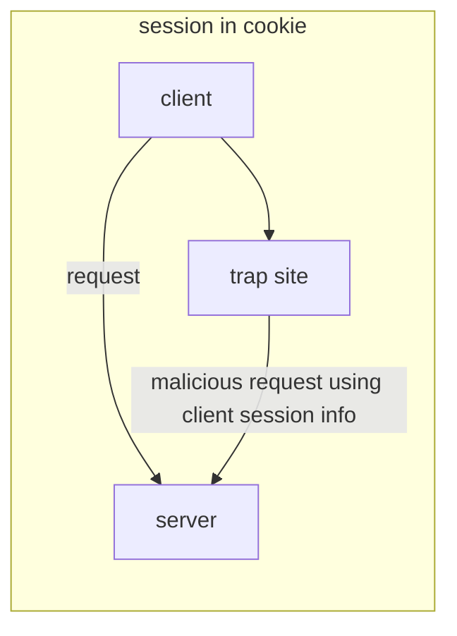

# Laravelで最強のセキュリティ対策を実装する

## 考えられるセキュリティ分野

- CSRF対策
- パスワードハッシュ
- 認証保持
- アクセス制御
- エラーハンドリング
- SQLインジェクション
- XSS対策
- CORS制御

## 対策

### CSRF対策

CSRF(クロスサイトリクエストフォージェリ)と呼ばれる外部ページからリクエストを送らせる攻撃。

上図からわかる通り、この攻撃の実態はclientが保持しているsession情報を使ってserverに不正アクセスを行うことである。

